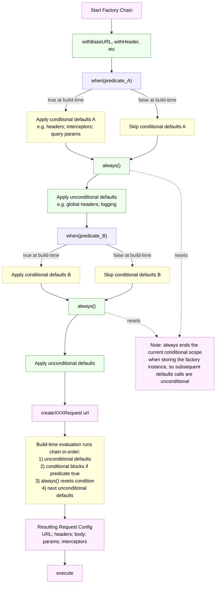

# Conditional Building

APIHive allows you to conditionally build requests. This is useful when you want to build requests based on runtime conditions.

There are two ways to conditionally build requests:

1. Using the factory build chain with `.when()`
2. Just in time configuration with `.withHeaders()`, `.withQueryParams()`, etc.

What method you'll use depends on your use case. The factory build chain is useful when you want to conditionally apply settings to all the requests built by the factory. Dynamic request builders are useful when you want to conditionally apply settings to a single request or the requests defined in an API config.

This page is about the factory build chain method.

::: tip More Info
See the [here](../guide/just-in-time-configuration.md) for more information on just in time configuration.
:::

## Using the factory build chain
`.when()` and `.always()` can be used on the factory build chain as delimiters to declare conditional defaults.

```typescript
const factory = new HTTPRequestFactory()
  .withBaseURL('https://api.example.com')
  .when(() => isProduction)
  .withHeader('Authorization', 'Bearer 123456789')
  .always()
  .withHeader('User-Agent', 'MyApp/1.0');
```

The condition is checked when the request is built.
`.when()` receives a read-only copy of the current request configuration. That can be used to conditionally apply settings.

```typescript
const factory = new HTTPRequestFactory()
  .withBaseURL('https://api.example.com')
  .when((config) => config.templateURL.includes('/admin/'))
  .withHeader('Authorization', 'Bearer: 123456789');

const posts = await factory
  .createGETRequest('/posts') // No Authorization header
  .execute();

const adminPosts = await factory
  .createGETRequest('/admin/posts') // Authorization header will be set
  .execute();
```

::: info
<a href="../demos/captcha-requests/"></a> 
<p>See <a href="../demos/captcha-requests/index.md">here</a> for a live demo of captcha injection using conditional factory build chain.</p>
:::

## Conditional factory build chain flow

The diagram below shows how `.when()` gates conditional defaults, how `.always()` resets the conditional scope, and how the chain is evaluated when a request is created.



## A word of caution
It's important to understand that the `.when()` method returns a proxy to the factory that is used to apply conditional defaults. So it's important to call `.always()` to reset the conditional scope when storing a factory instance.

Furthermore, `.when()` only affects the factory configuration methods (typically the ones that start with `with`). It does not affect the the request creation calls (e.g. `createGETRequest`, `createPOSTRequest`, etc).

::: code-group

```typescript{5} [<v-icon name="io-checkmark" />]
const factory = new HTTPRequestFactory()
  .withBaseURL('https://api.example.com')
  .when(() => isProduction)
  .withHeader('Authorization', 'Bearer 123456789')
  .always();

  factory.withHeader('User-Agent', 'MyApp/1.0'); //✅
```
```typescript{6-12} [<v-icon name="io-close" />]
const factory = new HTTPRequestFactory()
  .withBaseURL('https://api.example.com')
  .when(() => isProduction)
  .withHeader('Authorization', 'Bearer 123456789');

factory.withHeader('User-Agent', 'MyApp/1.0'); //⚠️
  /*
   * DANGER: `factory` is now a proxy to the factory 
   * that is used to apply conditional defaults. 
   * Any further customisation of the factory will be 
   * applied conditionally.
   */
```
:::